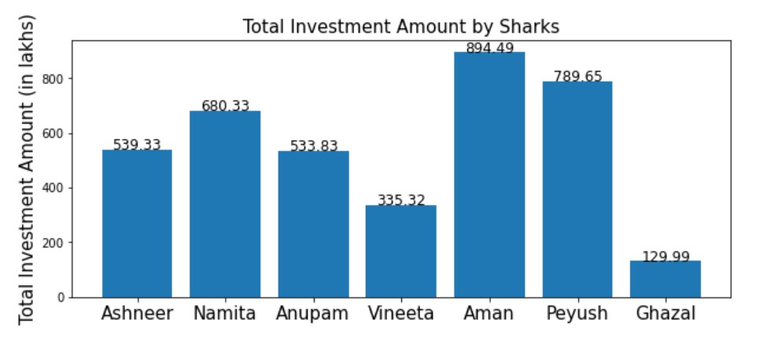

# Shark Tank India Data Analysis

## Business Objectives :

Shark Tank India is an Indian franchise of the original American hit reality show, “Shark Tank”. The premise is simple, entrepreneurs pitch their ideas for businesses or products to a panel of potential investors, the “Sharks”. The panellists themselves are self-made multi-millionaires who analyse the business models and products. Depending on the proposed venture, the Sharks will decide whether or not to invest their own money in marketing and mentoring the contestants. 

Meet the Sharks of Shark Tank India 2022. 

● Ashneer Grover: Managing Director and Co-Founder of BharatPe 

● Vineeta Singh: CEO and Co-Founder of SUGAR Cosmetics 

● Peyush Bansal: CEO and Co-Founder of Lenskart 

● Anupam Mittal: CEO and Founder of Shaadi.com and People Group 

● Namita Thapar: Executive Director of Emcure Pharmaceuticals 

● Aman Gupta: CMO and Co-Founder of boAT 

● Ghazal Alagh: Chief Mama and Co-Founder of MamaEarth 

## Data Collection :

The data was downloaded from github

This dataset comprises of 122 rows and 50 columns with details like pitchers name,business domain, amount asked, got offered or not and many more.

## Modelling :

The following modelling approach was used in the project:

1. Loading and Cleaning the raw data
2. Exploratory Data Analysis 
3. Data Visualization

The detailed analysis can be found in the .ipynb file. 

## Result :

The graphical representation is as follows:

## Conclusions :

We have plotted various graphs and from the graphs we can conclude many observations itself.

This was a short but detailed exploratory data analysis of Shark Tank India Season-1 from which we get that:

1. 121 total startups came in show for pitching, of which only 73% recieved an offer from sharks and total 76% of them accepted those offers.
2. Aman Gupta made the maximum investment of 894.49 lakhs and total least investment was made by Ghazal of 129.99 lakhs.
3. Portfolios details of different sharks can also be seen above in the notebook.

There can be many more questions and data insights which could be retrieved from this data ahead.
